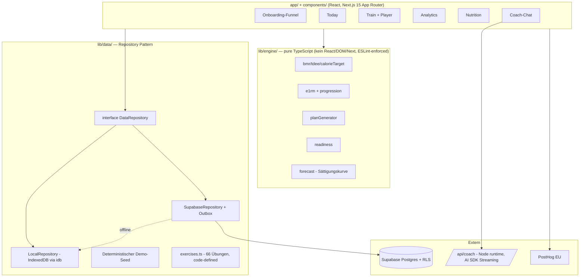

# METRICGYM

**Das Performance-Terminal für deinen Körper.** Whoop-grade Analytics + Fitbod-grade Trainingsintelligenz, ohne Hardware. Next.js 15 PWA, mobile-first (375 px Baseline), Dark-only „Obsidian Terminal" Design.

> Dieses Projekt lebt bewusst isoliert im Unterordner `metricgym/` dieses Repositories. Es teilt **keinen Code, keine Dependencies und keine Konfiguration** mit AlphaMetric (Repo-Wurzel). Deployment als eigenes Vercel-Projekt mit Root Directory `metricgym/`.

## Quickstart

```bash
cd metricgym
npm install
npm run dev        # http://localhost:3000
```

**Demo-Modus (Default):** Ohne env-Variablen läuft die App komplett lokal — `LocalRepository` (IndexedDB) + deterministischer 10-Wochen-Seed (fixer RNG-Seed). Sofort investor-demoable, null Backend.

### Scripts

| Script | Zweck |
| --- | --- |
| `npm run dev` | Dev-Server |
| `npm run build` / `start` | Production Build / Server |
| `npm run typecheck` | `tsc --noEmit` (strict, `noUncheckedIndexedAccess`) |
| `npm run lint` | ESLint inkl. Engine-Purity-Guard |
| `npm test` | Vitest: 111 Engine-Tests (table-driven + property-based) |
| `npm run test:e2e` | Playwright Demo-Smoke (375×812, headless) |

### Environment (`.env.example`)

Alles leer = Demo-Modus. Für Produktion:

- `NEXT_PUBLIC_SUPABASE_URL` / `NEXT_PUBLIC_SUPABASE_ANON_KEY` — Supabase-Projekt (**EU-Region**, DSGVO). Schema: `supabase/schema.sql`.
- `ANTHROPIC_API_KEY` — AI-Coach (sonst deterministische Mock-Streams).
- `NEXT_PUBLIC_POSTHOG_KEY` — Product Analytics (sonst typisierter No-op-Shim).

## Architektur



**Entscheidungen (final):**

- **Repository Pattern:** App-Code importiert ausschließlich `interface DataRepository` (`lib/data/repository.ts`). Env-Detection wählt die Implementierung. Demo = IndexedDB + Seed.
- **Offline-first:** Client-generierte **UUIDv7**-PKs, idempotente Upserts, Last-Write-Wins via `updated_at`, Outbox-Queue in IndexedDB (Flush bei App-Start + `online`-Event).
- **Engine-Isolation:** `lib/engine/` ist pures TypeScript — wird später unverändert nach React Native gehoben. ESLint `no-restricted-imports` erzwingt das.
- **Übungsbibliothek im Code:** stabile String-IDs, FK-lose Spalten in Postgres (dokumentiert in `supabase/schema.sql`).
- **RLS:** `user_id` denormalisiert auf `workout_sets`/`meals`/`checkins` → Single-Column-Policies. Plain btree-Indexes, bewusst kein Partitioning/BRIN auf MVP-Scale.
- **Charts:** Recharts für Linien/Flächen; Heatmap ist bewusst CSS-Grid. Zero-CLS: feste `aspect-[16/10]`-Frames.

## Screens

| Route | Inhalt |
| --- | --- |
| `/` | Landing: Hero, 3 Feature-Blöcke, Pricing, CTA |
| `/onboarding` | Performance-Assessment: 22 Quiz-Screens, BMR-/Split-Teaser, Medical Gate (PAR-Q), Reveal mit echter Engine-Berechnung, Signup-Wall, Paywall-Stub |
| `/app/today` | Readiness-Check-in (Score-Ring, Kalibrierungs-State), heutige Session, Streak |
| `/app/train` | Mesozyklus-Ansicht (Deload-Woche markiert), Muscle-Coverage-Bars, Workout-Player: Engine-Empfehlungen, Aufwärmsätze, Timestamp-Rest-Timer, Wake Lock, Swap, Session-Summary mit PR-Share-Card (1080×1350 Export) |
| `/app/analytics` | Readiness-Ring + 6 Module: Strength Trajectory (Forecast + Konfidenzband), PR-Card, Weekly Report (computed-on-read, gecacht), Volumen-Heatmap, Körperkomposition (7-Tage-Rolling), Plateau-Radar |
| `/app/nutrition` | Makro-Ringe (Trainings-/Ruhetag), Quick-Add, 40er-Quickliste, 7-Tage-Adhärenz |
| `/app/coach` | DSGVO-Art.-9-Consent-Gate → Streaming-Chat (aggregierter Kontext ≤ 900 Tokens, nie Roh-Logs), 4 Chips, Rate-Limit 10/h |
| `/app/settings` | Profil, Einheiten, Consent-Verwaltung, JSON-Export (Art. 20), Konto-Löschung (Art. 17) |

## Tests & CI

- **Engine (Vitest + fast-check):** Monotonie e1RM, reps=1 ⇒ e1RM=Gewicht, reps>10 ⇒ lowConfidence, Kalorien-Floors, kg↔lbs-Round-Trip ≤ 0,1, TDEE(Training) > TDEE(Ruhe), Forecast-Clamp +15 %/12 Wo.
- **Plan-Generator:** 50-Fälle-Matrix (Tage × Equipment × Verletzungen × Präferenzen) — keine Kontraindikationen, Frequenz ≥ 2×/Woche, Volumen-Band, Zeitbudget ≤ +10 %, Deload ≈ −40 %.
- **E2E (Playwright, 375×812):** Onboarding → Reveal → Workout (3 Sets inkl. PR) → PR-Card → Analytics (6 Module).
- **CI:** `.github/workflows/metricgym-ci.yml` (Repo-Wurzel, pfadgefiltert auf `metricgym/**`): typecheck → lint → unit → build → e2e. Rot = kein Merge.

## P1-Stubs (typisiert + TODO, bewusst nicht ausgebaut)

1. **Stripe-Checkout** — Paywall-Screen existiert (`paywall_viewed`-Event feuert), kein Payment (`components/onboarding/reveal.tsx`).
2. **Background-Sync-Trigger** — Outbox ist voll implementiert; der Service-Worker-`sync`-Event-Trigger fehlt (`lib/data/supabase-repository.ts`).
3. **Barcode-Scanner** — deaktivierter Button „Bald verfügbar" (`app/app/nutrition/page.tsx`).
4. **Server-seitiger Coach-Kontext** — Kontext wird clientseitig aggregiert (Demo-Modus hat keinen Server-Store); Umzug in den Route-Handler für Supabase-Modus (`lib/coach-context.ts`).
5. **`plan_days`-Normalisierung** — Tabelle existiert im Schema; Client hält das Mesozyklus-JSON autoritativ (`supabase/schema.sql`).

## Hinweise

- **Supabase EU-Region** wählen (DSGVO, Gesundheitsdaten).
- Playwright lokal: `npx playwright install chromium` (CI macht das selbst).
